# Guia de Estilo 

O guia de estilo visual orienta a unidade e a coerência visual na apresentação de uma marca e em sua oferta de serviços no cenário digital.

| Data       | Versão | Descrição                                           | Autor              |
| ---------- | ------ | --------------------------------------------------- | ------------------ |
| 11/03/2021 | 0.1    | Adicionado template               | Gabriel Albino |
| 11/03/2021 | 0.2    | Adicionado Objetivos, Cores e Layout Iniciado Tipografia |Gabriel Albino|
| 15/03/2021 | 1.0    | Adicionado Tipografia e marca |Gabriel Albino|

## Objetivo
Esse documento tem como objetivo demonstrar os elementos de interfaces, servindo de ponto de partida para garantir um serviço digital consistente, independente do seu alcance, número de páginas ou micro serviços.

Em qualquer situação, o guia de estilo deve agir como a âncora de confiança que mantém todas as intenções de design criativo corretamente interpretadas e traduzidas para todos que estão trabalhando no desenvolvimento e na entrega de um serviço. 

O guia de estilo também tem função de repositório para facilitar o trabalho dos desenvolvedores front-end: quando eles podem utilizar componentes comuns em diversas páginas, sem precisar criar soluções do zero a todo momento, o desenvolvimento adquire bastante velocidade

### 1. Cores
Esta paleta inclui as cores primárias e secundárias do **Parlamentaqui**. As cores base são utilizadas no portal para manter a consistência.

#### 1.1 Cores Primárias
As cores primáras se baseam em variações das cores verde e marrom. O verde representa a principal cor da bandeira Brasileira, servido para abraçar a nacionalidade e o representar o país. O Marrom representa a sujeira causada pela currupção, presente em diversas formas diferentes e em diferentes camadas da política.

|Hexadecimal|RGB|Nome|Uso|
|-|-|-|-|
|#A4D4B4|164,212,180|Verde Musgo|Fundo de elementos específicos de cada página|
|#3B1C32|59,28,50|Marrom Lívido|Fundo de componentes transversais e detalhes|
|#2C2229|44,34,41|Marrom Tempestade|Detalhes diversos|
|#D2FFE1|210,255,255|Menta Nevado|Detalhes diversos|

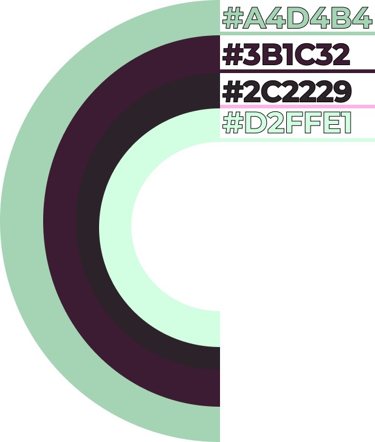

#### 1.2 Cores Secundárias
Estas cores devem ser usadas para textos como parágrafos e títulos. E também usadas para destacar alguma seção da página.

|Hexadecimal|RGB|Nome|
|-|-|-|
|#212529|33,37,41|Cinza Tubarão|
|#343A40|52,58,64|Cinza Espacial|
|#DADADA|218,218,218|Cinza Alto|
|#FFFFFF|255,255,255|Branco|

Uso conforme seção 1.3.

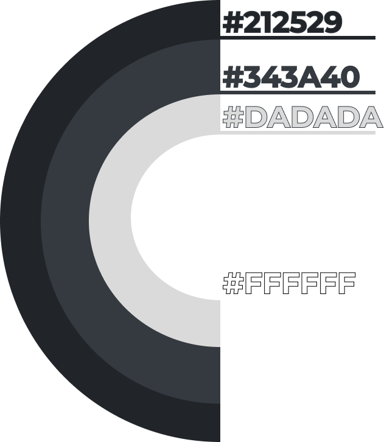

#### 1.3 Contrastes
As cores de texto para cada fundo devem ser utilizadas conforme a relação abaixo.

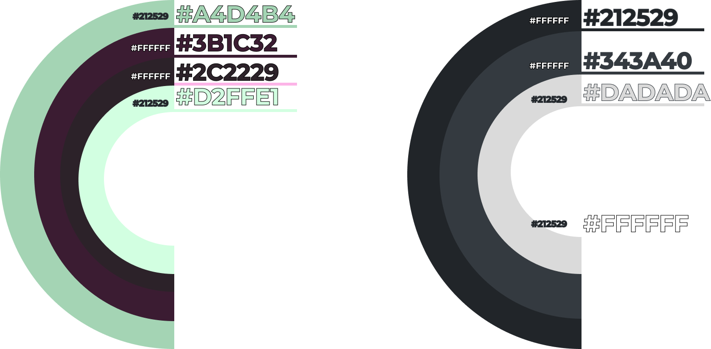

### 2. Layout
Foram estabelecidas algumas diretrizes para garantir um bom comportamento do **Parlamentaqui** em todos os dispositivos.

#### 2.1 Grids
As grids garantem uma boa organização do conteúdo dentro do portal e devem ser respeitadas. 

O sistema de grid utilizado no projeto é o do Bootstrap, que usa uma série de contêineres, linhas e colunas para fazer o layout e alinhar o conteúdo. Ele é construído com flexbox e é totalmente responsivo. Abaixo está um exemplo e uma análise detalhada de como a grid se junta.

|Distância entre Colunas (Gutters)|Distância entre Linhas (Row)|
|-|-|
|24px|24px|

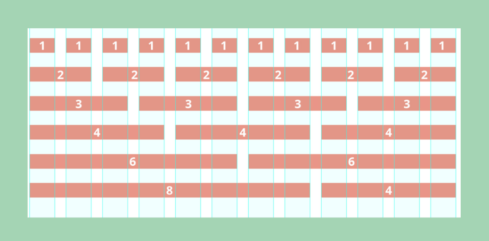

#### 2.2 Grids em dispositívos

A organização criada pelas grids deve ser respeitada em todos os dispositivos, especialmente por ser adaptável a todos eles.

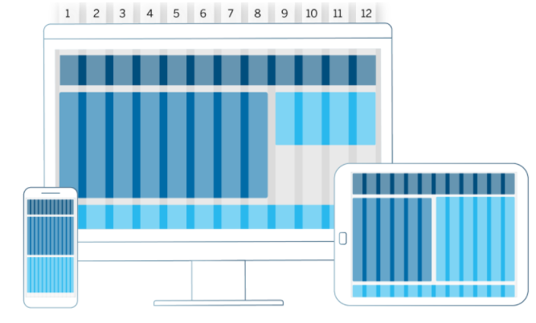

#### 2.3 Estrutura padrão (elementos)

Todas as páginas do portal deve seguir a seguinte estrutura

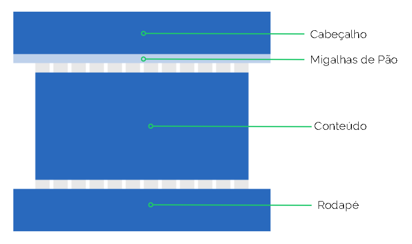

### 3. Tipografia

A Fonte escolhida para o **Parlamentaqui** foi a Open Sans. E é a família de fonte usada em conteúdos de todo o site. Para títulos, foi escolhida a Montserrat. Ambas as fontes encontram-se no Google Fontes, garantindo qualidade e velocidade no carregamento.
A proporção de fontes utilizadas foi definida utilizando a escala "Minor Third"

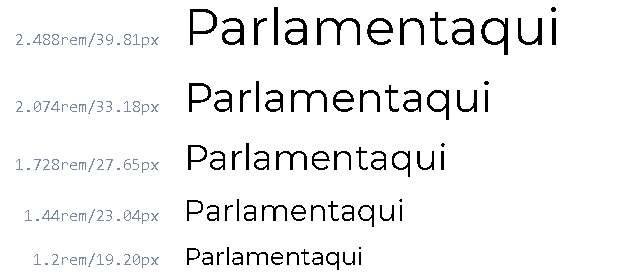

Na imagem acima é possível identificar os títulos de h1 a h5 (respectivamente, variando de 2.488rem a 1.2rem na fonte Montserrat).

Para os demais elementos, deve ser utilizada a fonte Open sans tamanho 16px ou 13.33px em caso de texto pequeno, conforme imagem abaixo.

### 4. Marca
A logo do projeto representa as cúpulas do congresso nacional de Brasília, a arte e o processo encontram-se abaixo

#### 4.1 Logo

#### 4.2 Processo
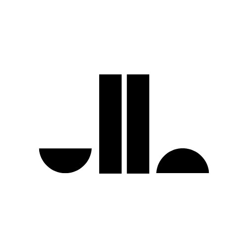
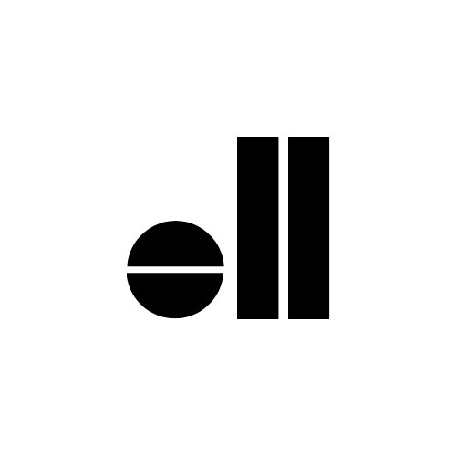
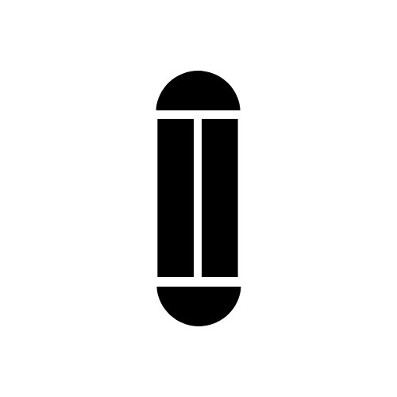
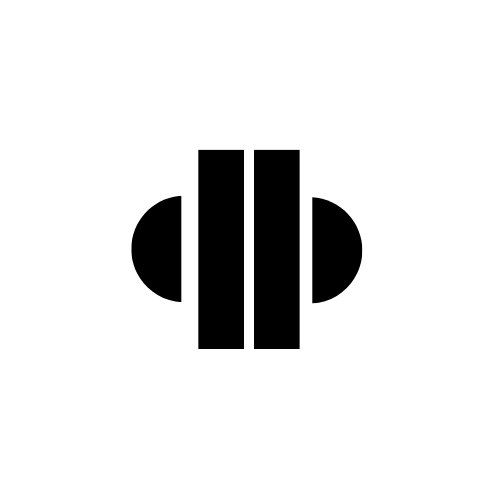
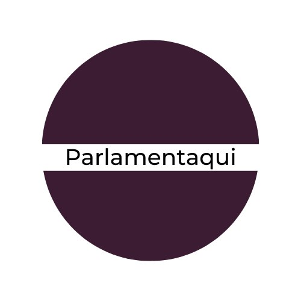
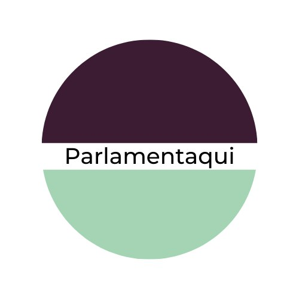
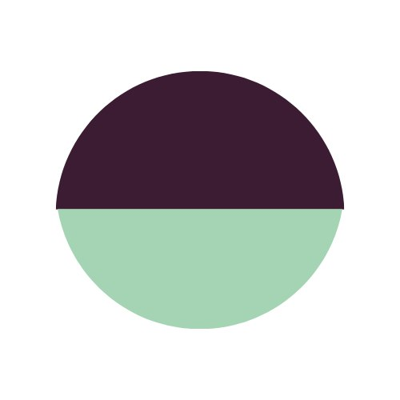

