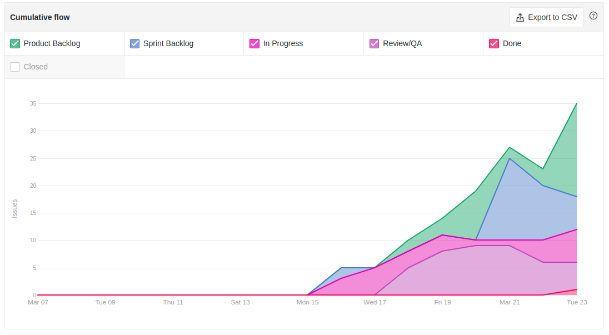

# Release 1

| Data       | Versão | Descrição                          | Autor          |
| ---------- | ------ | ---------------------------------- | -------------- |
| 23/03/2021 | 0.1    | Adicionado template                |  Helena Bretas |
| 23/03/2021 | 1.0    | Direcionando entregas da release 1 | Helena Bretas |

## Introdução

Este é um guia que possibilita encontrar as entregas do projeto até a Release 1, assim como os artefatos solicitados pelo docente.

## Identificação da equipe

Este projeto corresponde ao grupo 6, e é desenvolvido por: 

### Equipe de gerência, composta por alunos de Engenharia do Produto de Software

| Nome           | Função                | Conta Github |
|----------------|-----------------------| ----------------|
| Felipe Campos  | Devops                | [@fepas](https://github.com/fepas) |
| Gabriel Albino | Product Owner         | [@gabrielalbino](https://github.com/gabrielalbino) |
| Helena Bretas  | Scrum master          | [@helenagoulart](https://github.com/helenagoulart) |
| Lucas Machado  | Arquiteto de software | [@lmmLucasMachado](https://github.com/lmmLucasMachado) |

### Equipe de desenvolvimento, composta por alunos de Métodos de Desenvolvimento de Software

| Nome              | Função         | Conta Github |
|-------------------|----------------| ----------------|
| Cibele Freitas    | Desenvolvedora | [@CibeleG](https://github.com/CibeleG) |
| Cristian Furtado  | Desenvolvedor  | [@csafurtado](https://github.com/csafurtado) |
| Eduarda Rodrigues | Desenvolvedora | [@erteduarda](https://github.com/erteduarda) |
| João Pedro Lyra   | Desenvolvedor  | [@jplyra](https://github.com/jplyra) |
| Mariana Oliveira  | Desenvolvedora | [@MarianaPRio](https://github.com/MarianaPRio) |
| Rafael Fernandes  | Desenvolvedor  | [@Rafael-gc](https://github.com/Rafael-gc) |

## Artefatos

## Documento de Visão do Projeto

O documento de visão pode ser encontrado [aqui](./Documentos/doc_visao.md).

Apesar de ser um artefato mais burocrático e que a visão do produto possa ser compreendida pelo desenvolvimento do Lean Inception, a equipe optou por mantê-lo: 

Por ser um software livre, caso futuros contribuintes tenham interesse em compreender o projeto e não estejam familiarizados com o Lean Inception, o documento estará de fácil acesso.

## Planejamento e cronograma

O planejamento foi realizado concomitantemente com o cronograma das disciplinas Engenharia do Produto de Software e Métodos de Desenvolvimento de Software. Para entender como a equipe se adaptou e organizou neste período, é possível conhecer o cronograma do projeto [aqui](./Documentos/cronograma_do_produto.md).

## Comunicação Interna e Externa

A comunicação da equipe se deu através de 2 ferramentas:

- Discord: utilizado em pareamentos, reuniões gerais e envio de dailies; 

- Telegram: usado em discussões mais informais como avisos internos e diálogos cotidianos.

## Documento de Arquitetura do Projeto

Este documento foi desenvolvido pelos gerentes de software e validado pelo docente das disciplinas envolvidas no projeto. Para visualiza-lo, basta clicar [aqui](./Documentos/arquitetura.md).

## Especificação das esstorias de usuários (critérios de aceitação)

Os requisitos do projeto, assim como as estórias de usuário, puderam ser obtidas através do Lean Inception. Para conhecer o backlog do produto e as estórias de usuário, basta clicar [aqui](./Documentos/backlog.md).

## Configuração do repositório de acordo com os padrões de comunidade de software livre (Github)

A licença de software livre escolhida pela equipe foi a MIT. Para entender seu comportamento e suas respectivas permissões, basta acessar ao documento [aqui](./Software_livre.md).

## Protótipo de alta fidelidade

Este artefato foi desenvolvido na ferramenta Figma, que possibilita criar telas e fluxos com diversos membros da equipe. Para conhecer o protótipo, basta [clicar aqui](https://www.figma.com/file/UWBRoMSkFlLrO0S0t9yHFc/Parlamentaqui?node-id=0%3A1).

Para executar e navegar no fluxo do site, não se esqueça de clicar no ícone **Present**, no canto superior direito da página ao lado do icone **Share**.

## Cumulative flow do projeto

Este tópico trata-se de um gráfico que mostra a maneira como as tarefas são montadas e sua distribuição ao longo dos diferentes estágios do processo. O gráfico é construído a partir de diferentes faixas coloridas, que dividem as tarefas em quatro grupos: fila, execução, testes/validação, completas.

# Visão do produto

Você pode encontrar o projeto no site: [www.parlamentaqui.com](www.parlamentaqui.com)

